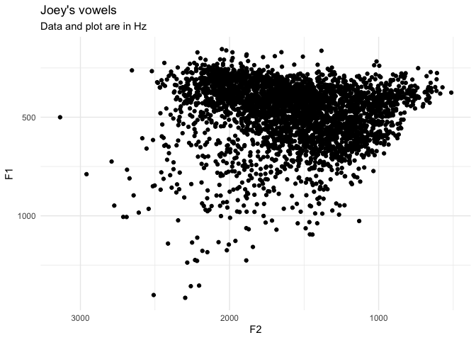
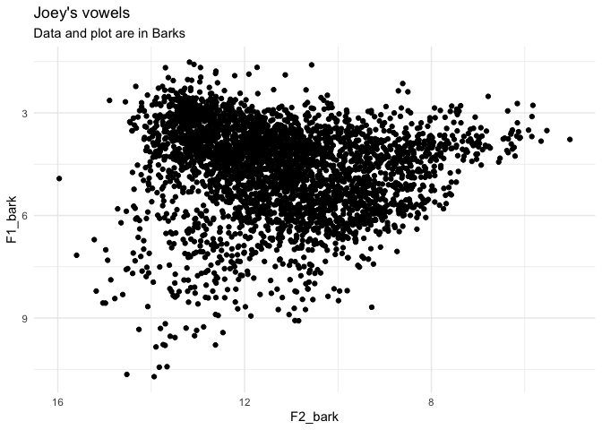
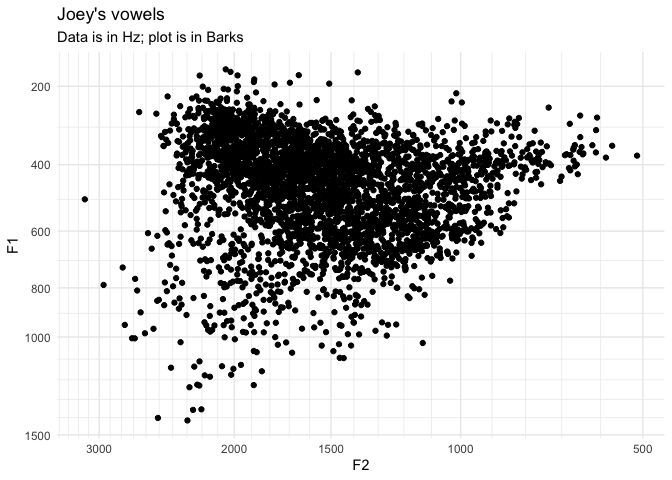
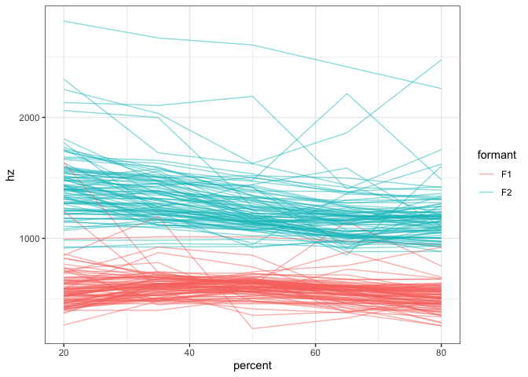
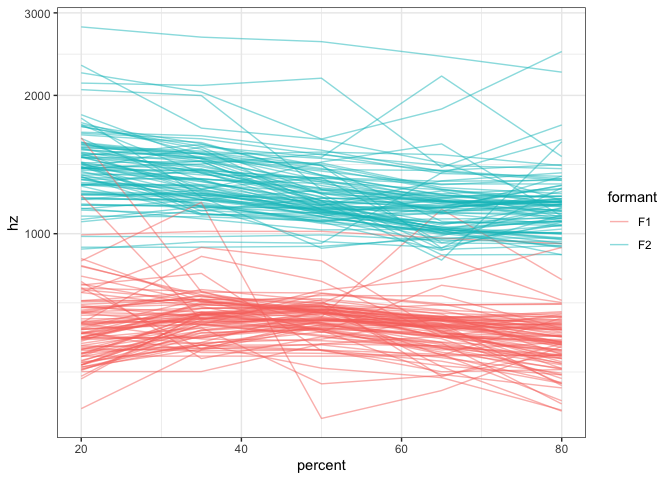

# barktools

Functions to help when working with Barks.

This package makes it easier to work with the Bark scale when analyzing
and plotting acoustic data. It contains two pairs of functions. The
first (`bark` and `hz`) convert between Hz and Barks. The other
(`scale_x_bark` and \`scale\_y\_bark\`\`) make it easy to plot data in
ggplot2 usingthe Bark scale.

## Load the data

For this little vignette, I’ll load some sample vowel data from my own
speech. It’s got some outliers, but that’s the nature of
automatically-processed data.

``` r
library(tidyverse)
vowels <- read_csv("http://joeystanley.com/data/joey.csv")
```

Here’s a simple plot that shows my vowel space. For now, I’ll just keep
it simple.

``` r
ggplot(vowels, aes(F2, F1)) + 
  geom_point() + 
  scale_x_reverse() + 
  scale_y_reverse() + 
  theme_minimal() + 
  labs(title = "Joey's vowels",
       subtitle = "Data and plot are in Hz")
```

<!-- -->

Now, let’s say I want to plot using Barks. You can use the `bark()`
function to convert the formant frequencies into Barks.

``` r
vowels_with_barks <- vowels %>%
  mutate(F1_bark = bark(F1),
         F2_bark = bark(F2))

ggplot(vowels_with_barks, aes(F2_bark, F1_bark)) + 
  geom_point() + 
  scale_x_reverse() + 
  scale_y_reverse() + 
  theme_minimal() + 
  labs(title = "Joey's vowels",
       subtitle = "Data and plot are in Barks")
```

<!-- -->

The Bark scale turns the nonlinear Hz data into something a little more
linear, so the shape of the vowel space should change somewhat.

The problem is most people can’t readily interpret the Barks unit. What
is the Hz equivalent of 6 Barks? We can look this up using the `hz()`
function:

``` r
hz(6)
```

    ## [1] 631.1045

But it would be better if we could incorporate more interpretable values
into the plot itself. I think the first time I saw this was in
[Harrington et al’s (2000)
paper](https://www.jstor.org/stable/44526873?seq=1#metadata_info_tab_contents)
on how the Queen of England’s speech changes over
time:


Notice how the axes are in Barks, but the data is still plotted in Hz.
This is a perfect case for using the `scale_x_bark()` and
`scale_y_bark()` functions. Like the other `scale_*` functions in
ggplot2, this will transform the axes of your plot. In this case, it’ll
convert the plotting area to the Bark scale, but the values will be in
Hz still.

``` r
ggplot(vowels, aes(F2, F1)) + 
  geom_point() + 
  scale_x_bark() + 
  scale_y_bark() + 
  theme_minimal() + 
  labs(title = "Joey's vowels",
       subtitle = "Data is in Hz; plot is in Barks")
```

<!-- -->

Now, you can see that the shape of the vowel space is identical to the
plot above, except the axis labels are more useful: I have a better idea
of what 500Hz means. Note that the axes are reversed as well, just like
`scale_*_reverse`.

At this point, it might be useful to modify the axes with some
additional labels. Since `scale_*_bark` is just a wrapper around
`scale_*_continuous`, any argument that you would normally include in
the latter function will work just fine in the bark function.
Specifically, I’ll modify which values get labels with `breaks` and the
gridlines with `minor_breaks`.

``` r
ggplot(vowels, aes(F2, F1)) + 
  geom_point() + 
  scale_x_bark(breaks = c(c(500, 1000, 1500, 2000, 3000)),
               minor_breaks = seq(0, 4000, 100)) +
  scale_y_bark(breaks = c(c(200, 400, 600, 800, 1000, 1500)),
               minor_breaks = seq(0, 3000, 100)) + 
  theme_minimal() + 
  labs(title = "Joey's vowels",
       subtitle = "Data is in Hz; plot is in Barks")
```

<!-- -->

Exactly which values you want to put is up to you, obviously, so play
around with it until it looks good.

## Spectrogram plots

The other type of plot you might want to use `scale_y_bark` for is
something that looks like a spectrogram, that is a time-by-hz plot.
You’ll have to transform the data a little bit. You can use the code
that I provided in my
[tutorial](http://joeystanley.com/blog/reshaping-vowel-formant-data-with-tidyr)
with the new `pivot_longer` function in `dplyr`. I’ll just pull out my
/ai/ vowel for this plot:

``` r
vowels_long <- vowels %>%
  filter(vowel == "AW") %>%
  select(contains("@")) %>%
  rowid_to_column("phoneme_id") %>%
  pivot_longer(cols = contains("@"), 
               names_to = c("formant", "percent"), 
               names_pattern = "(F\\d)@(\\d\\d)%", 
               names_ptypes = list(formant = factor(levels = c("F1", "F2")),
                                   percent = integer()), 
               values_to = "hz") %>%
  unite(traj_id, phoneme_id, formant, remove = FALSE)
```

Here’s what a spectroram-like plot might look
like

``` r
ggplot(vowels_long, aes(percent, hz, color = formant, group = traj_id)) + 
  geom_path(alpha = 0.5) +
  theme_bw()
```

<!-- -->

Now, a lot of the change in /ai/ happens along the F1 dimension, but
because of the logorithmic nature of sound, F2 visually takes up most of
the vertical space and F1 is sort of squished down at the bottom. We can
emphasize F1 by transforming the *y*-axis into the Bark
scale.

``` r
ggplot(vowels_long, aes(percent, hz, color = formant, group = traj_id)) + 
  geom_path(alpha = 0.5) +
  scale_y_bark(rev = FALSE) + 
  theme_bw()
```

<!-- -->

Note that this time, I added the argument `rev = FALSE` to
`scale_y_bark`. By default, the function will flip the axis (like
`scale_y_reverse`), but in this case that behavior is not desired. So,
you can suppress that flip by specifying `rev = FALSE`.

## Conclusion

And that’s it\! That’s the whole package. I had the idea for
`scale_*_bark` while falling asleep a few days ago and thought it would
be a useful thing for me. Perhaps you’ll find some use for it too.
