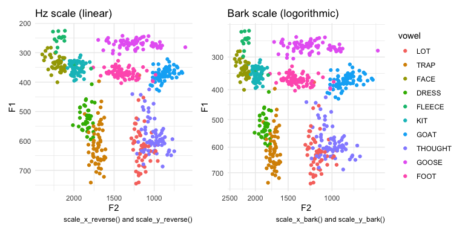
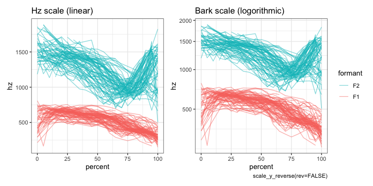

# barktools \

Functions to help when working with Barks.

This package makes it easier to work with the Bark scale when analyzing
and plotting acoustic data. It contains two pairs of functions. The
first (`bark` and `hz`) convert between Hz and Barks. The other
(`scale_x_bark` and `scale_y_bark`) make it easy to plot data in ggplot2
using the Bark scale.

``` r
library(barktools)
library(dplyr) # version <1.0.0
library(ggplot2)
```

## Plotting in the Bark scale

You can use `scale_x_bark` and `scale_y_bark` within a `ggplot` to plot
the data in Hz but scaled into Barks. In the following side-by-side
comparison of an F1-F2 plot, the figure on the left uses a linear scale.
Meanwhile, in the figure on the right, the left and bottom portions of
the plot is more compressed.

<!-- -->

The plot on the right looks the same as if you had plotted the data in
Barks themselves, except the axes are in Hz instead of Barks.

In the following spectrogram plots, we only need to use the Bark scale
along the *y*-axis. In the left panel, which displays the data in a
linear scale, F2 takes up the majorty of the plot. Meanwhile, in the
plot on the right, F1 is wider and F2 is more compressed.

<!-- -->

## Converting between Barks and Hz

You can also use `barktools` to convert between hz and barks with the
`hz` and `barks` functions:

``` r
bark(500)
```

    ## [1] 4.919187

``` r
hz(3)
```

    ## [1] 297.1993

You can use this to convert entire vectors as well:

``` r
data(vowels)
head(vowels$F1)
```

    ## [1] 367.7 376.7 314.4 273.7 349.5 313.2

``` r
head(bark(vowels$F1))
```

    ## [1] 3.705098 3.792047 3.176060 2.755086 3.527196 3.163864

Or, more elegantly, with in a tidyverse pipeline:

``` r
vowels %>%
  select(vowel, F1, F2, F3, F4) %>%
  mutate(across(F1:F4, bark, .names = "{col}_bark"))
```

    ## # A tibble: 564 x 9
    ##    vowel      F1    F2    F3    F4 F1_bark F2_bark F3_bark F4_bark
    ##    <fct>   <dbl> <dbl> <dbl> <dbl>   <dbl>   <dbl>   <dbl>   <dbl>
    ##  1 GOAT     368. 1018. 2602. 3168.    3.71    8.63    14.8    16.0
    ##  2 FACE     377. 2032. 2761. 3408.    3.79   13.1     15.2    16.5
    ##  3 FACE     314. 2179. 2915. 3380.    3.18   13.6     15.5    16.4
    ##  4 GOOSE    274. 1378. 2235. 3270.    2.76   10.5     13.8    16.2
    ##  5 FOOT     350. 1624. 2485. 3384.    3.53   11.6     14.5    16.4
    ##  6 FACE     313. 2181. 2863. 3205.    3.16   13.6     15.4    16.1
    ##  7 GOOSE    255. 1333. 2313. 3212.    2.55   10.3     14.0    16.1
    ##  8 THOUGHT  585   969. 2813. 3405     5.63    8.34    15.3    16.5
    ##  9 THOUGHT  527. 1201. 2733. 3434.    5.15    9.66    15.1    16.5
    ## 10 FOOT     367. 1594. 2477  3367     3.70   11.5     14.4    16.4
    ## # … with 554 more rows
