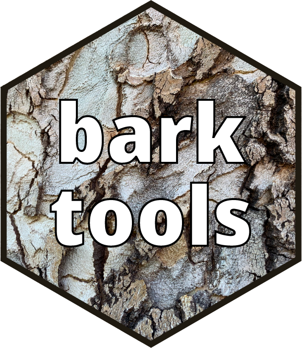

# barktools 

Functions to help when working with Barks.

This package makes it easier to work with the Bark scale when analyzing
and plotting acoustic data. It contains two pairs of functions. The
first (`bark` and `hz`) convert between Hz and Barks. The other
(`scale_x_bark` and `scale_y_bark`) make it easy to plot data in ggplot2
using the Bark scale.
